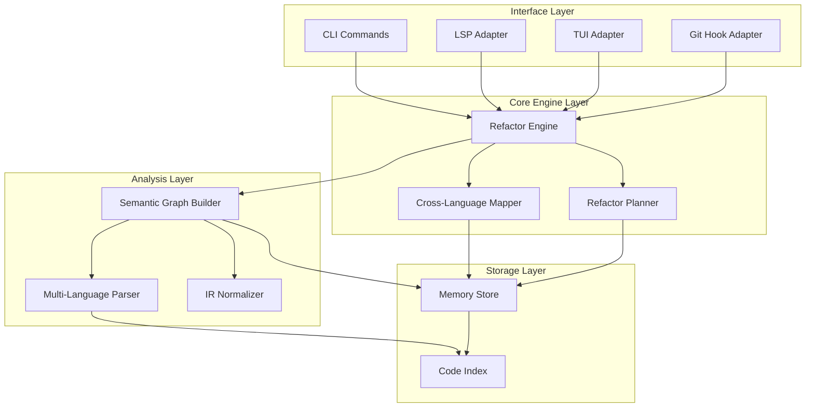

# Design Document: Cross-Language Refactor Engine

## Overview

The Cross-Language Refactor Engine extends the cli_codex project to provide semantic understanding and refactoring capabilities across TypeScript, Go, Python, Rust, and Java. The system builds a local semantic graph representing code entities and their relationships, normalizes language-specific constructs into a common intermediate representation, identifies equivalent constructs across languages, and generates safe multi-step refactor plans with diffs.

The engine operates entirely locally without external dependencies, prioritizing correctness, debuggability, and safety for large multi-language monorepos. All semantic analysis, cross-language mapping, and refactor planning occurs in-process with persistent local storage.

### Key Design Goals

1. **Correctness**: Validate all transformations through precondition checking and round-trip parsing
2. **Safety**: Never modify code directly; generate plans and diffs for human review
3. **Performance**: Handle monorepos with 1M+ lines of code through incremental updates and parallel processing
4. **Debuggability**: Comprehensive logging, introspection commands, and human-readable exports
5. **Extensibility**: Plugin architecture for new languages and configurable mapping rules

## Architecture

The system consists of six major subsystems organized in layers:



### Component Responsibilities

**Interface Layer**:
- **CLI Commands**: Command-line interface for analyze, map, check, plan, query, diff operations
- **LSP Adapter**: Language Server Protocol integration for IDE features (go-to-definition, find-references, diagnostics, code actions)
- **TUI Adapter**: Terminal UI for interactive graph visualization and exploration
- **Git Hook Adapter**: Pre-commit, post-commit, and pre-push hooks for validation and updates

**Core Engine Layer**:
- **Refactor Engine**: Orchestrates all operations, manages lifecycle, coordinates subsystems
- **Cross-Language Mapper**: Identifies structurally similar constructs across languages, computes confidence scores
- **Refactor Planner**: Generates multi-step transformation plans with preconditions, effects, and uncertainty markers

**Analysis Layer**:
- **Multi-Language Parser**: Parses TypeScript, Go, Python, Rust, Java into language-specific ASTs
- **IR Normalizer**: Converts language-specific ASTs into language-agnostic semantic nodes
- **Semantic Graph Builder**: Constructs graph of entities (nodes) and relationships (edges)

**Storage Layer**:
- **Memory Store**: Persists semantic graphs, construct mappings, inconsistencies, refactor plans
- **Code Index**: Existing cli_codex index mapping file paths to summaries

## Components and Interfaces

### Semantic Graph

The semantic graph is the central data structure representing code entities and their relationships.

#### Node Structure

```rust
pub struct SemanticNode {
    pub id: NodeId,              // Unique identifier
    pub name: String,            // Entity name
    pub node_type: NodeType,     // Function, Type, Variable, Module
    pub language: Language,      // Source language
    pub scope: ScopeId,          // Containing scope
    pub visibility: Visibility,  // Public, Private, Protected, Internal
    pub location: SourceLocation,// File path, line, column
    pub attributes: HashMap<String, AttributeValue>, // Language-specific metadata
    pub doc_comment: Option<String>, // Documentation
}

pub enum NodeType {
    Function { params: Vec<Parameter>, return_type: Option<TypeRef> },
    Type { kind: TypeKind, fields: Vec<Field> },
    Variable { var_type: Option<TypeRef>, mutable: bool },
    Module { exports: Vec<NodeId> },
}

pub enum TypeKind {
    Interface,
    Struct,
    Class,
    Enum,
    Trait,
    Dataclass,
}

pub struct SourceLocation {
    pub file_path: PathBuf,
    pub start_line: usize,
    pub start_col: usize,
    pub end_line: usize,
    pub end_col: usize,
}
```

#### Edge Structure

```rust
pub struct SemanticEdge {
    pub id: EdgeId,
    pub source: NodeId,
    pub target: NodeId,
    pub edge_type: EdgeType,
    pub location: SourceLocation, // Where the relationship is expressed
    pub attributes: HashMap<String, AttributeValue>,
}

pub enum EdgeType {
    Calls,           // Function calls function
    Imports,         // Module imports module/entity
    Inherits,        // Type inherits from type
    Implements,      // Type implements interface/trait
    References,      // Entity references entity
    Contains,        // Scope contains entity
    TypeOf,          // Variable has type
}
```

#### Graph Operations

```rust
pub trait SemanticGraph {
    // Node operations
    fn add_node(&mut self, node: SemanticNode) -> NodeId;
    fn get_node(&self, id: NodeId) -> Option<&SemanticNode>;
    fn remove_node(&mut self, id: NodeId) -> Option<SemanticNode>;
    fn find_nodes(&self, predicate: &dyn Fn(&SemanticNode) -> bool) -> Vec<NodeId>;
    
    // Edge operations
    fn add_edge(&mut self, edge: SemanticEdge) -> EdgeId;
    fn get_edge(&self, id: EdgeId) -> Option<&SemanticEdge>;
    fn remove_edge(&mut self, id: EdgeId) -> Option<SemanticEdge>;
    fn find_edges(&self, predicate: &dyn Fn(&SemanticEdge) -> bool) -> Vec<EdgeId>;
    
    // Navigation
    fn outgoing_edges(&self, node: NodeId) -> Vec<EdgeId>;
    fn incoming_edges(&self, node: NodeId) -> Vec<EdgeId>;
    fn neighbors(&self, node: NodeId, edge_type: Option<EdgeType>) -> Vec<NodeId>;
    
    // Traversal
    fn traverse_dfs(&self, start: NodeId, visitor: &mut dyn FnMut(NodeId, usize));
    fn traverse_bfs(&self, start: NodeId, visitor: &mut dyn FnMut(NodeId, usize));
    fn find_path(&self, from: NodeId, to: NodeId) -> Option<Vec<EdgeId>>;
    
    // Bulk operations
    fn nodes_in_file(&self, path: &Path) -> Vec<NodeId>;
    fn remove_file(&mut self, path: &Path) -> Vec<NodeId>;
}
```

### Language IR and Normalization

The IR normalizer converts language-specific AST constructs into language-agnostic semantic nodes.

#### Normalization Rules

**Type Definitions**:
- TypeScript `interface` → `NodeType::Type { kind: TypeKind::Interface }`
- Go `struct` → `NodeType::Type { kind: TypeKind::Struct }`
- Python `
@dataclass` → `NodeType::Type { kind: TypeKind::Dataclass }`
- Rust `struct` → `NodeType::Type { kind: TypeKind::Struct }`
- Java `class` → `NodeType::Type { kind: TypeKind::Class }`
- Java `interface` → `NodeType::Type { kind: TypeKind::Interface }`

**Type Annotations**:
- TypeScript `string` → `TypeRef::Primitive(PrimitiveType::String)`
- Go `string` → `TypeRef::Primitive(PrimitiveType::String)`
- Python `str` → `TypeRef::Primitive(PrimitiveType::String)`
- Rust `String` → `TypeRef::Named("String")` (with stdlib marker)
- Java `String` → `TypeRef::Named("String")` (with stdlib marker)

**Visibility Modifiers**:
- TypeScript: default export → `Visibility::Public`, no export → `Visibility::Private`
- Go: uppercase → `Visibility::Public`, lowercase → `Visibility::Private`
- Python: no underscore → `Visibility::Public`, single underscore → `Visibility::Protected`, double underscore → `Visibility::Private`
- Rust: `pub` → `Visibility::Public`, `pub(crate)` → `Visibility::Internal`, default → `Visibility::Private`
- Java: `public` → `Visibility::Public`, `protected` → `Visibility::Protected`, `private` → `Visibility::Private`, default → `Visibility::Internal`

#### IR Normalizer Interface

```rust
pub trait IRNormalizer {
    fn normalize_type_def(&self, ast_node: &ASTNode, language: Language) -> Result<SemanticNode>;
    fn normalize_function(&self, ast_node: &ASTNode, language: Language) -> Result<SemanticNode>;
    fn normalize_variable(&self, ast_node: &ASTNode, language: Language) -> Result<SemanticNode>;
    fn normalize_module(&self, ast_node: &ASTNode, language: Language) -> Result<SemanticNode>;
    fn normalize_type_ref(&self, type_node: &ASTNode, language: Language) -> Result<TypeRef>;
    fn normalize_visibility(&self, ast_node: &ASTNode, language: Language) -> Visibility;
}
```

### Multi-Language Parser

The parser subsystem uses language-specific parsing libraries to generate ASTs.

#### Parser Interface

```rust
pub trait LanguageParser {
    fn language(&self) -> Language;
    fn parse_file(&self, path: &Path, content: &str) -> Result<ParseResult>;
    fn extract_doc_comment(&self, ast_node: &ASTNode) -> Option<String>;
    fn pretty_print(&self, node: &SemanticNode) -> Result<String>;
}

pub struct ParseResult {
    pub ast: ASTNode,
    pub errors: Vec<ParseError>,
    pub is_partial: bool, // True if parsing succeeded despite errors
}

pub struct ParseError {
    pub location: SourceLocation,
    pub message: String,
    pub severity: ErrorSeverity,
}
```

#### Language-Specific Parsers

- **TypeScript**: Use `swc_ecma_parser` or `tree-sitter-typescript`
- **Go**: Use `tree-sitter-go`
- **Python**: Use `rustpython-parser` or `tree-sitter-python`
- **Rust**: Use `syn` crate
- **Java**: Use `tree-sitter-java`

All parsers implement the `LanguageParser` trait and are registered with the parser registry.

### Cross-Language Mapper

The mapper identifies structurally similar constructs across languages.

#### Construct Mapping Structure

```rust
pub struct ConstructMapping {
    pub id: MappingId,
    pub nodes: Vec<NodeId>,           // Mapped nodes (2+ from different languages)
    pub confidence: f64,              // 0.0 to 1.0
    pub similarity_metrics: SimilarityMetrics,
    pub uncertainty_markers: Vec<UncertaintyMarker>,
    pub created_at: Timestamp,
}

pub struct SimilarityMetrics {
    pub name_similarity: f64,         // Levenshtein distance based
    pub structural_similarity: f64,   // Field count, type matches
    pub semantic_similarity: f64,     // Usage patterns, relationships
}

pub struct UncertaintyMarker {
    pub reason: UncertaintyReason,
    pub description: String,
    pub affected_fields: Vec<String>,
}

pub enum UncertaintyReason {
    TypeMismatch,
    NameMismatch,
    FieldCountMismatch,
    VisibilityMismatch,
    MissingInLanguage,
}
```

#### Mapping Algorithm

```rust
pub trait CrossLanguageMapper {
    fn find_mappings(&self, graph: &SemanticGraph) -> Vec<ConstructMapping>;
    fn compute_similarity(&self, node1: &SemanticNode, node2: &SemanticNode) -> SimilarityMetrics;
    fn should_map(&self, metrics: &SimilarityMetrics, config: &MapperConfig) -> bool;
}
```

**Mapping Process**:
1. Group nodes by type kind (Interface, Struct, Class, etc.)
2. For each pair of nodes from different languages:
   - Compute name similarity (normalized Levenshtein distance)
   - Compute structural similarity (field count ratio, type matches)
   - Compute semantic similarity (shared callers, similar usage patterns)
3. If combined similarity exceeds threshold, create mapping
4. Add uncertainty markers for mismatches
5. Store mapping with confidence score

### Refactor Planner

The planner generates multi-step transformation plans with preconditions and effects.

#### Refactor Plan Structure

```rust
pub struct RefactorPlan {
    pub id: PlanId,
    pub operation: RefactorOperation,
    pub steps: Vec<RefactorStep>,
    pub safety_score: f64,
    pub created_at: Timestamp,
}

pub enum RefactorOperation {
    Rename { target: NodeId, new_name: String },
    Move { target: NodeId, new_location: ScopeId },
    ChangeType { target: NodeId, new_type: TypeRef },
    Extract { source: NodeId, range: SourceRange, new_name: String },
    Inline { target: NodeId },
}

pub struct RefactorStep {
    pub step_number: usize,
    pub description: String,
    pub affected_nodes: Vec<NodeId>,
    pub preconditions: Vec<Precondition>,
    pub effects: Vec<Effect>,
    pub uncertainty_markers: Vec<UncertaintyMarker>,
    pub rollback_step: Option<Box<RefactorStep>>,
}

pub struct Precondition {
    pub condition_type: PreconditionType,
    pub description: String,
    pub validation_result: Option<bool>,
}

pub enum PreconditionType {
    NodeExists,
    NoNameConflict,
    TypeCompatible,
    AccessibilityMaintained,
    NoCircularDependency,
}

pub struct Effect {
    pub effect_type: EffectType,
    pub description: String,
    pub affected_files: Vec<PathBuf>,
}

pub enum EffectType {
    NodeModified,
    EdgeAdded,
    EdgeRemoved,
    FileModified,
}
```

#### Planning Algorithm

```rust
pub trait RefactorPlanner {
    fn generate_plan(&self, operation: RefactorOperation, graph: &SemanticGraph) -> Result<RefactorPlan>;
    fn validate_preconditions(&self, step: &RefactorStep, graph: &SemanticGraph) -> Vec<PreconditionResult>;
    fn compute_safety_score(&self, plan: &RefactorPlan) -> f64;
    fn generate_diffs(&self, plan: &RefactorPlan, graph: &SemanticGraph) -> Result<Vec<FileDiff>>;
}
```

**Planning Process**:
1. Analyze operation to identify affected nodes
2. Traverse graph to find all dependencies (direct and transitive)
3. Generate ordered steps based on dependency order
4. For each step, define preconditions and expected effects
5. Validate preconditions against current graph state
6. Add uncertainty markers for ambiguous transformations
7. Compute safety score based on precondition validation
8. Generate rollback steps for each transformation

### Memory Store

The memory store persists all semantic data to local storage.

#### Storage Schema

```rust
pub trait MemoryStore {
    // Graph persistence
    fn save_graph(&mut self, graph: &SemanticGraph) -> Result<()>;
    fn load_graph(&self) -> Result<SemanticGraph>;
    fn update_nodes(&mut self, nodes: &[SemanticNode]) -> Result<()>;
    fn update_edges(&mut self, edges: &[SemanticEdge]) -> Result<()>;
    
    // Mapping persistence
    fn save_mappings(&mut self, mappings: &[ConstructMapping]) -> Result<()>;
    fn load_mappings(&self) -> Result<Vec<ConstructMapping>>;
    fn query_mappings(&self, filter: MappingFilter) -> Result<Vec<ConstructMapping>>;
    
    // Inconsistency tracking
    fn save_inconsistencies(&mut self, inconsistencies: &[Inconsistency]) -> Result<()>;
    fn load_inconsistencies(&self) -> Result<Vec<Inconsistency>>;
    
    // Plan persistence
    fn save_plan(&mut self, plan: &RefactorPlan) -> Result<()>;
    fn load_plans(&self, filter: PlanFilter) -> Result<Vec<RefactorPlan>>;
    
    // Query interface
    fn query_nodes(&self, query: NodeQuery) -> Result<Vec<NodeId>>;
    fn query_edges(&self, query: EdgeQuery) -> Result<Vec<EdgeId>>;
    fn traverse(&self, start: NodeId, traversal: TraversalSpec) -> Result<Vec<NodeId>>;
}
```

**Storage Format**:
- Use SQLite for structured queries (nodes, edges, mappings)
- Use JSON for complex nested structures (plans, inconsistencies)
- Store file paths as relative paths from repository root
- Index nodes by name, type, language, file path
- Index edges by type, source, target
- Support incremental updates without full rewrites

### Diff Generation

The diff generator produces unified diffs for refactor plans.

#### Diff Structure

```rust
pub struct FileDiff {
    pub file_path: PathBuf,
    pub original_content: String,
    pub modified_content: String,
    pub hunks: Vec<DiffHunk>,
    pub stats: DiffStats,
}

pub struct DiffHunk {
    pub original_start: usize,
    pub original_count: usize,
    pub modified_start: usize,
    pub modified_count: usize,
    pub lines: Vec<DiffLine>,
}

pub struct DiffLine {
    pub line_type: DiffLineType,
    pub content: String,
    pub line_number: Option<usize>,
}

pub enum DiffLineType {
    Context,
    Added,
    Removed,
}

pub struct DiffStats {
    pub lines_added: usize,
    pub lines_removed: usize,
    pub lines_modified: usize,
}
```

#### Diff Generation Process

1. For each affected file in refactor plan:
   - Load original file content
   - Apply transformations to generate modified content
   - Validate modified content parses correctly
   - Compute unified diff with 3 lines of context
   - Add warning annotations for uncertainty markers
2. Group diffs by refactor step
3. Compute statistics for each diff
4. Format as standard unified diff (compatible with `patch` command)

## Data Models

### Core Data Structures

**NodeId and EdgeId**:
```rust
#[derive(Debug, Clone, Copy, PartialEq, Eq, Hash)]
pub struct NodeId(u64);

#[derive(Debug, Clone, Copy, PartialEq, Eq, Hash)]
pub struct EdgeId(u64);

#[derive(Debug, Clone, Copy, PartialEq, Eq, Hash)]
pub struct ScopeId(u64);
```

**Language Enum**:
```rust
#[derive(Debug, Clone, Copy, PartialEq, Eq)]
pub enum Language {
    TypeScript,
    Go,
    Python,
    Rust,
    Java,
}
```

**TypeRef**:
```rust
#[derive(Debug, Clone, PartialEq)]
pub enum TypeRef {
    Primitive(PrimitiveType),
    Named(String),
    Generic { base: Box<TypeRef>, args: Vec<TypeRef> },
    Array(Box<TypeRef>),
    Optional(Box<TypeRef>),
    Function { params: Vec<TypeRef>, return_type: Box<TypeRef> },
    Unknown,
}

#[derive(Debug, Clone, Copy, PartialEq, Eq)]
pub enum PrimitiveType {
    String,
    Int,
    Float,
    Bool,
    Void,
}
```

**Parameter and Field**:
```rust
#[derive(Debug, Clone)]
pub struct Parameter {
    pub name: String,
    pub param_type: Option<TypeRef>,
    pub optional: bool,
    pub default_value: Option<String>,
}

#[derive(Debug, Clone)]
pub struct Field {
    pub name: String,
    pub field_type: Option<TypeRef>,
    pub visibility: Visibility,
    pub mutable: bool,
    pub optional: bool,
}
```

**Visibility**:
```rust
#[derive(Debug, Clone, Copy, PartialEq, Eq)]
pub enum Visibility {
    Public,
    Protected,
    Private,
    Internal, // Package-private in Java, pub(crate) in Rust
}
```

**Inconsistency**:
```rust
#[derive(Debug, Clone)]
pub struct Inconsistency {
    pub id: InconsistencyId,
    pub mapping: MappingId,
    pub inconsistency_type: InconsistencyType,
    pub severity: Severity,
    pub description: String,
    pub affected_nodes: Vec<NodeId>,
    pub detected_at: Timestamp,
}

#[derive(Debug, Clone, Copy, PartialEq, Eq)]
pub enum InconsistencyType {
    FieldCountMismatch,
    TypeMismatch,
    NameMismatch,
    VisibilityMismatch,
    MissingConstruct,
}

#[derive(Debug, Clone, Copy, PartialEq, Eq, PartialOrd, Ord)]
pub enum Severity {
    Info,
    Warning,
    Error,
}
```

### Query Models

**NodeQuery**:
```rust
pub struct NodeQuery {
    pub name_pattern: Option<String>,
    pub node_types: Vec<NodeType>,
    pub languages: Vec<Language>,
    pub file_pattern: Option<String>,
    pub visibility: Option<Visibility>,
}
```

**EdgeQuery**:
```rust
pub struct EdgeQuery {
    pub edge_types: Vec<EdgeType>,
    pub source_filter: Option<NodeQuery>,
    pub target_filter: Option<NodeQuery>,
}
```

**TraversalSpec**:
```rust
pub struct TraversalSpec {
    pub direction: TraversalDirection,
    pub edge_types: Vec<EdgeType>,
    pub max_depth: Option<usize>,
    pub visitor: Box<dyn Fn(NodeId, usize) -> bool>, // Return false to stop
}

pub enum TraversalDirection {
    Outgoing,
    Incoming,
    Both,
}
```

## 